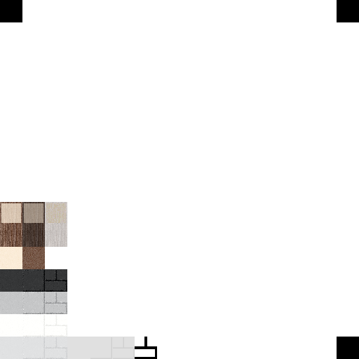

> 2026-04-10: Create `.env.example`

> 2026-04-04: WIP

---

# r

### What?

The best voxel engine ever ...

### CLI:

```
cat .env # Optional
pip install -r req.txt
python main.py
```

### Customization:

- Create your own map in `DIR-Maps` ... set your map in `.env` (`_MAP`)
- Edit other variables in `.env`
- Edit the textures in `DIR-Resources/IMG-Texture.png`

### Atlas:


